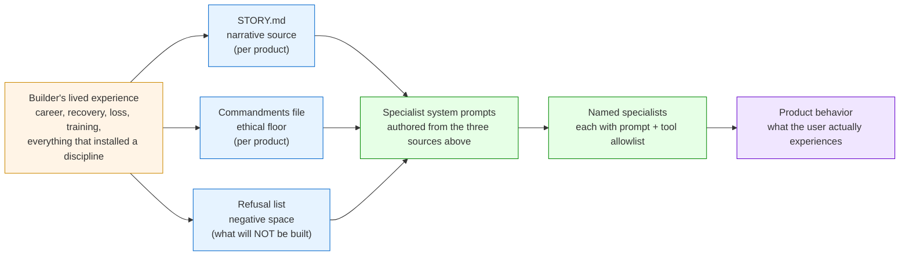
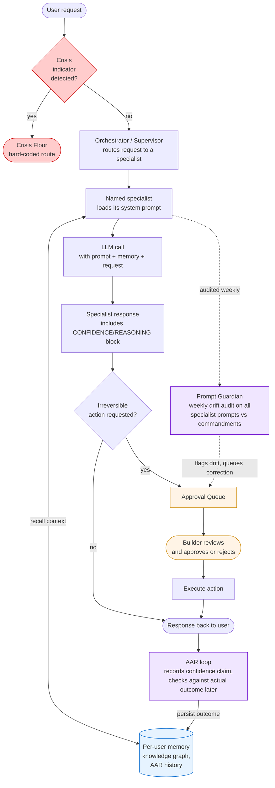

# THE BUILDERS' METHOD

**A reproducible framework for AI builders whose lived experience should compile into product behavior, not be lost to it.**

**Method v1.0 — 2026-05-01 — by Hans Prahl**
**Status: agnostic edition. Derived from The Builders Doctrine v1.1, with the three portability findings from synthetic test 2026-05-01 incorporated. Distributable.**

---

## Prime Directive

You build AI as agentic versions of yourself — your ethics and lived experience encoded into code that acts within your intent and stops at irreversible. The moat is memory, not model. Designed to be needed less, not more. Truth is architecture; the lie detector is built in. A clean room rebuilds your product from doctrine and commits within forty-eight hours, or your product is a snowflake and the method has failed you.

This document is the framework. The biography is yours to bring.

---

## I. Why this method exists

Most AI products are artisanal. The founder's lived experience — the discipline that makes their judgment good, the ethics that make their choices defensible, the experience that lets them spot when a model is lying — is in the founder's head, not in the product. When the founder steps away, the product stops being theirs. When the next builder picks it up, the product becomes someone else's. There is no method, only artifacts. The portfolio does not compound. The lived experience does not transfer. The product is the founder's pulse signature on a model. When the pulse moves on, the signature fades.

This method prevents that. It defines the principles, the artifacts, the architecture of trust, and the measurement surface that turn lived experience into reproducible product behavior. The method is shared. The biography is yours.

Three drivers force the method:

1. **Reproducibility is the test.** Grant reviewers, due-diligence partners, technical audits, and external builders all ask the same question — is this an artisanal one-off or a system. The answer must be a document, not a pitch.

2. **Bad prompt equals bad agent.** The chassis amplifies whatever the prompt says. Prompt engineering is a first-class discipline. The Prompt Doctrine that sits below this method is the most important technical layer.

3. **Technical-and-human is the distinctive thing.** Most builders are technical-only or vibes-only. The moat is being both. The method demonstrates the blend or the method is failing.

This is who the method is for: anyone whose biography is the unfair advantage they want their product to carry. If your moat is your model choice, you do not need this method. If your moat is who you have been and what you have survived, you need it more than you think.

---

## II. The Eleven Principles

Eleven principles. Seven foundational ethics that govern what the product stands for. Four operational doctrines that govern how the ethics translate into product architecture. Each principle is stated three ways: the **principle** (what is true), the **why** (what makes the principle non-optional), the **how to apply** (what you do as the builder), and the **in code** (where the principle is enforced as a real mechanism).

### Foundational Ethics

#### 1. The code is the story

**Principle.** Products are stories compiled into software. Whoever builds a product encodes their story — ethics, doctrine, lived experience — into agents that act within the builder's intent. The builder's psychology is in the product whether the builder intends it or not. The work is to encode the regulated builder, deliberately.

**Why.** Compilation happens regardless of consent. If you do not write the story down, the product encodes whatever version of you was in the room when you wrote the prompt — including the unregulated, exhausted, defensive, or wounded version. The choice is not whether the product carries you. The choice is whether you write the carrying down on purpose.

**How to apply.** Maintain a `STORY.md` per product. The STORY.md is the source narrative the product's prompts are derived from. It is not a marketing document. It is engineering input. Update it when your understanding of yourself in relation to the product changes — typically once a quarter, more often during crisis or pivot.

**In code.** Every specialist's system prompt is authored against the STORY.md and the commandments file (Principle 7). Every Guardian audits drift against those commandments. The biography is in the training data because the prompts are the training data, and the builder writes the prompts.

#### 2. The moat is the memory

**Principle.** Technical moats erode. Biographical and relational moats do not.

**Why.** Models are commoditized in quarters. Features are copied in months. What does not commoditize is the accumulated memory of every relationship and every lived event the product carries on behalf of its user. That memory is unfakeable because it was earned in real time at real cost. A competitor with a faster model and a slicker UI cannot synthesize a year of a user's history on your platform.

**How to apply.** Build per-user memory on day one. Persistent. Per-user-isolated. Survives model swaps. Includes at minimum: a knowledge graph of entities the user has discussed, an AAR history of decisions made and outcomes, a relationship score for each contact in the user's domain, conversation continuity. Treat data isolation as non-negotiable architecture, not a feature.

**In code.** Per-user memory is a primary data store. The model layer is swappable; the memory layer is not. Authentication establishes user context at every entry point. `LookupError` (or your language's equivalent) is the correct behavior when user context is unset — never fall back to a default user. Per-user-isolated, no silent shared state.

#### 3. Designed to be needed less, not more

**Principle.** The dependency test is the filter for every feature. Does this make the user more capable, or more reliant. If the answer is reliance, the feature does not ship.

**Why.** Engagement-maximization is the failure mode of consumer software for the past two decades. It is the design pattern that has done measurable harm. AI products inherit the temptation by default — every feature is an opportunity to be the user's first thought. The discipline is to refuse the temptation as architecture, not as marketing copy.

**How to apply.** Define what "less needed" means in your product's domain. The answer varies. For a wellness product: the user becomes more capable without the tool over time. For an operator tool (campaign software, business agents): the operator becomes more capable at their work, with less time spent in the tool per unit of output. For a caregiver tool (medical, eldercare): the caregiver becomes a more effective advocate under crisis conditions, less paralyzed by complexity. List the success criterion for your product explicitly. Audit features against it.

**In code.** Each product has a "Scaffold, don't crutch" or equivalent commandment in its commandments file. The Guardian (Principle 7) scores prompts against the dependency test. Engagement-maximizing patterns (variable rewards, streak gamification, fear-of-missing-out triggers) are listed in the refusal list and never ship.

#### 4. Chain of command over autonomous AI

**Principle.** The builder sets the intent. The agents execute within scope. Irreversible actions require explicit approval. Always.

**Why.** An agent acting outside the builder's intent is not capability — it is liability. The risk scales with the agent's reach. Drafting an email is recoverable. Sending one is not. Posting publicly, contacting external parties, charging cards, scheduling commitments, deleting data — none of these are recoverable through clever architecture. They are recoverable only by not doing them without permission.

**How to apply.** Define the irreversible action list per product. Build an Approval Queue that gates every irreversible action. The agent never executes an irreversible action directly. The agent proposes; the builder (or an explicitly designated approver) confirms. Two-gate compounding is the standard: an environmental kill switch (e.g. dry-run mode for the whole product) plus a structural queue (per-action approval). Either alone is insufficient.

**In code.** Approval Queue is a first-class component, alongside the orchestrator and memory. Every tool that touches the outside world routes through the queue. Specialists can call the queue but cannot bypass it.

#### 5. Data sovereignty

**Principle.** User data belongs to the user. Chain of custody, proof of destruction, full portability.

**Why.** The default posture of the AI industry treats user data as a resource for the platform. The legal regime treats it differently in different jurisdictions. The ethical posture is unambiguous: the user's data is theirs. The product is a steward, not an owner.

**How to apply.** Local-first storage for sensitive content where feasible. No third-party processors for sensitive data without explicit user consent and a written agreement (BAA, DPA, or equivalent for your domain). Per-user data export must work end-to-end and produce a usable dataset, not a tarball nobody can read. Per-user data destruction must be honored within the timeline your domain requires (24h for emergencies, 30d for routine deletion). Audit logs every access to sensitive data.

**In code.** Pre-commit credential blockers (gitleaks or equivalent). Domain-specific PII isolation in storage and in logs. Aggregated data only sent to LLMs unless the user has explicitly authorized otherwise. No silent fallbacks on user context.

#### 6. Truth as architecture

**Principle.** The product cannot lie to the builder without leaving evidence in the audit trail.

**Why.** Soft information kills. In high-stakes domains — medical, military, financial, political, recovery — the cost of a softened answer is paid by someone other than the speaker. The same dynamic plays out between an AI agent and the builder of the product. If the agent reports success when it has not succeeded, the builder loses calibration. The product becomes unreliable in ways the builder cannot see. The fix is not better prompts. The fix is structural: every agent response carries a confidence claim that gets checked.

**How to apply.** Require every specialist to emit a structured CONFIDENCE/REASONING block on every response. Persist the block to the knowledge graph. Run an AAR (after-action review) loop that records the outcome of each decision and checks the agent's claimed confidence against the actual result over time. A specialist that consistently overclaims confidence is flagged for prompt review.

**In code.** CONFIDENCE/REASONING is a parsed structure, not freeform text. The orchestrator parses it; the knowledge graph stores it; the AAR loop reads it. Calibration data is per-specialist, per-task-type, accumulated over time.

#### 7. Commandments rooted in your ethical framework

**Principle.** Every product has a commandments file that names the ethical floors the product will not violate, and a Guardian that audits drift against them.

**Why.** Without an explicit commandments file, the product's ethics are wherever the prompts happened to land that day. With a commandments file, drift becomes measurable. The framework you root your commandments in — Stoicism, palliative-care ethics, professional codes (legal, medical, military), religious ethics, secular humanism — is yours to choose. The discipline of having the file is universal. The contents of the file are biographical.

**How to apply.** Choose your ethical framework deliberately. Articulate the commandments in writing — typically five to twelve commandments, each one or two sentences. Examples for one builder: *honest before comfortable, no cheerleading, no engagement maximization, contentment not happiness*. Examples for another builder: *no false hope, no toxic positivity, honor not knowing, no replacement for human grief support*. Different frameworks, same architectural pattern. Ship the commandments file in the product repo. Audit drift against it weekly.

**In code.** Commandments file is a first-class artifact in the product repo. The Prompt Guardian runs scheduled (typically weekly) audits scoring every specialist prompt against the commandments. Drift triggers a queued correction; the builder approves or rejects.

### Operational Doctrines

#### 8. The Refusal

**Principle.** The method is what you refuse as much as what you build. Every "will build" is bounded by an explicit "will not." Negative space is enforced.

**Why.** Without an explicit refusal list, scope creep eats the principles. A product asked to do everything will eventually be asked to do something it should not. The refusal list makes the answer pre-decided. The pre-decision is the discipline.

**How to apply.** Maintain a refusal list per product. Examples of refusal categories: surveillance products, parasocial replacements for human relationships, engagement-maximization apps, products that claim to predict what they cannot, products that gamify domains where gamification harms. Yours will differ. Make the list public to your team and to your users. Update it deliberately, never under pressure.

**In code.** Refusal list lives at the product repo root. New feature specs cite the refusal list explicitly. The pull request template asks: *does this feature touch any item on the refusal list*. If yes, the feature halts pending explicit refusal-list update.

#### 9. AI as co-author

**Principle.** The builder is not the only author. Every commit, every prompt, every decision document names both contributors — the builder and the AI assistant.

**Why.** The honest engineering record matters. AI assistance changes what is possible for a non-developer founder, for a small team, for a solo builder. Pretending the assistance does not exist is a small dishonesty that compounds — in attribution, in audit, in succession planning. Pretending the assistance is doing the work alone is the opposite small dishonesty. The truth is in the middle: the builder sets intent and judgment, the AI executes and accelerates, neither alone produces the product. Name both.

**How to apply.** Every commit message ends with a `Co-Authored-By` line naming the AI model used. Every significant decision document names both contributors. The convention is small but compounding — your audit trail is honest about its authorship.

**In code.** Pre-commit hook checks for the `Co-Authored-By` line on commits where AI assistance was used. Decision documents include an AI-co-author header. Code generated entirely by AI is flagged for builder review before merge.

#### 10. Named specialists, never anonymous prompts

**Principle.** Every AI agent has a name, a defined job, a tool allowlist, and a system prompt audited by the Guardian. Anonymous prompts do not ship.

**Why.** Anonymous prompts are anonymous soldiers — no accountability, no track record, no improvement. When something goes wrong, you cannot tell which prompt failed, why, or whether other instances of the same anonymous pattern are also failing. Naming forces accountability. The named specialist accumulates a track record. Calibration becomes possible. Drift becomes detectable.

**How to apply.** Every specialist has a name (e.g. *wellness_specialist*, *delegate_whip*, *symptom_translator*). Every specialist has a defined scope of work and a tool allowlist enforced at runtime. Every specialist's system prompt lives in the codebase, not in a runtime configuration that drifts unaudited. Adding a new specialist follows the SPECIALIST_TEMPLATE.md checklist (Principle 7's commandments + Principle 6's CONFIDENCE block + Principle 4's approval queue + Principle 2's memory hooks).

**In code.** Specialists are first-class objects with metadata: name, prompt path, tool allowlist, calibration history, last Guardian score. The orchestrator routes by name, never by ad-hoc instruction. New specialist requires SPECIALIST_TEMPLATE.md sign-off before merging.

#### 11. Crisis floors above features

**Principle.** If your product can encounter a user in crisis, the crisis response is hard-coded above every feature. It cannot be turned off, gated, A/B-tested, or bypassed.

**Why.** Crisis is the moment the user needs the product to do exactly the right thing. It is not a moment for variant testing. It is not a moment for a paywall. It is not a moment for the agent to be uncertain. Hard-code the floor. Make the floor unkillable.

**How to apply.** This is the principle that requires the most domain-specific work. The *pattern* (hard-coded above features, ungated, A/B-test-forbidden, escalation route is named in plain language at the top of the response) is universal. The *trigger condition* — what counts as crisis in your product — is biographical and product-specific. A wellness AI's crisis is suicidal ideation or acute psychiatric crisis. A pediatric oncology caregiver tool's crisis is acute medical emergency. A campaign tool's crisis is candidate threat or election-day field emergency. A financial tool's crisis is suspected elder financial abuse. Define yours explicitly. Document the trigger conditions. Document the escalation route (e.g. *Veterans Crisis Line 988 press 1*, or *call 911 and notify your child's care team immediately*).

**In code.** Crisis check fires before routing. The check is the first node in the runtime flow, not a wrapper around routing. The escalation response is templated and tested. The trigger conditions are documented in the product's `SECURITY.md` or `CRISIS.md`. The Guardian audits drift in the crisis-handling specialist on a weekly cadence with a hard-floor commandment that cannot fall below 100%.

---

## III. The Required Artifacts

The principles above produce real files in your product repository. If a principle does not produce a file, the principle is not honored — only aspirational. Below is the minimum artifact set every product applying this method must contain.

### STORY.md

The narrative source the prompts are derived from. Personal, biographical, dated. Updated when your understanding of yourself in relation to the product changes. Not a marketing document. Engineering input.

**Minimum contents.** A founding-narrative section (why you built this product). A discipline-installed section (what each chapter of your life installed that the product now carries). A current-state section (where you are now, what is open). A pivot-marker section (the dates and reasons your understanding of the product shifted).

### Commandments file

The ethical floors the product will not violate. Five to twelve commandments. One or two sentences each. Rooted in your chosen ethical framework. Audited by the Guardian on a weekly cadence.

**Minimum contents.** Each commandment named, written in declarative language (the product *will not* / *will*). A short paragraph for each commandment explaining what it covers and why it exists. A meta-section naming the framework (Stoic, palliative-care, professional code, religious, secular) so the framework is explicit, not implicit.

### Refusal list

The categories of features the product will not contain. Public. Updated deliberately, never under pressure.

**Minimum contents.** Each refused category named. A short paragraph for each refusal explaining the harm being refused. A pull-request template that explicitly checks proposed features against the list.

### SPECIALIST_TEMPLATE.md

The build sheet for adding a new agent. Ensures every named specialist wires the doctrine integrations before merging.

**Minimum contents.** Required fields (name, scope, tool allowlist, prompt path). Required wiring (commandments file linkage, CONFIDENCE block in response, approval queue routing for irreversible actions, memory recall + persist hooks). Required tests (Guardian score, calibration baseline, refusal-list check).

### Crisis trigger document

The named crisis trigger conditions and the escalation route for each.

**Minimum contents.** Trigger conditions (detection criteria, with examples and edge cases). Escalation route per trigger (the named resource, the plain-language language). A test plan that exercises every trigger.

### AGENT_DOCTRINE.md (the chassis)

The agentic network framework that all named specialists conform to. Eleven components: durable history, named specialists, token trimming, routing, proactive intel, knowledge graph, confidence scoring, running estimates, AAR, battle tracking, event bus.

**Minimum contents.** Each component named, defined, and pointed at the file or module that implements it. New specialist adoption requires all eleven components to be wired.

### PROMPT_DOCTRINE.md

The universal structural rules every prompt across every product follows. Sits below this method, applies to any prompt regardless of domain.

**Minimum contents.** Prompt section schema (role, task, tools, constraints, output format, examples). Anti-patterns list (twelve or so common prompt failure modes). Six-dimension scoring rubric the Guardian uses (clarity, robustness, token efficiency, production readiness, structural conformance, commandment alignment). Model-family rules (vendor-specific quirks).

### SECURITY.md

The hard floors per product. Things that cannot be violated. Domain-specific.

**Minimum contents.** Data isolation rules. Authentication boundaries. Audit logging requirements. Incident response timeline. Rate limits where enumeration is a risk.

---

## IV. The Architecture of Trust

Trust is not a marketing claim. Trust is the property of a system in which every principle in Section II maps to a specific enforcement mechanism that exists in code. If the mechanism is not in code, the principle is not honored. Below is the mapping. Verify each row in your own product. Do not list a mechanism that does not exist.

| Principle | Mechanism | What it gates |
|---|---|---|
| 1. The code is the story | STORY.md authored, prompts derived from it | What enters the prompts |
| 2. The moat is the memory | Per-user memory store, isolated, persistent | What the agent remembers between turns |
| 3. Designed to be needed less | "Scaffold, don't crutch" commandment + Guardian audit | What features can ship |
| 4. Chain of command | Approval Queue + irreversible-action list | What the agent can execute |
| 5. Data sovereignty | Per-user isolation, gitleaks pre-commit, audit log | What leaves the product |
| 6. Truth as architecture | CONFIDENCE/REASONING block + AAR loop | What the agent claims |
| 7. Commandments + Guardian | Commandments file + scheduled drift audit | What the agent says |
| 8. The Refusal | Refusal list + PR-template check | What features are proposed |
| 9. AI as co-author | Co-Authored-By commit hook | Who the audit trail names |
| 10. Named specialists | Specialist registry + SPECIALIST_TEMPLATE checklist | Which agent handled which request |
| 11. Crisis floors | Crisis check as first-node + hard-floor Guardian commandment | What the agent does in crisis |

---

## V. The Doctrine Stack

The method sits at the top of a layered doctrine stack. Layers below the method are technical. Layers above the method are biographical (your STORY.md, your commandments, your refusals). The stack is what makes the framework reproducible.

```
Builder's Biography (STORY.md, Commandments, Refusal List)
        ↓
THE BUILDERS' METHOD                  ← this document, agnostic
        ↓
Per-product CLAUDE.md                  ← product-specific rules
        ↓
AGENT_DOCTRINE.md                      ← 11-component agentic chassis
        ↓
PROMPT_DOCTRINE.md                     ← universal prompt structural rules
        ↓
SECURITY.md                            ← per-product hard floors
        ↓
SPECIALIST_TEMPLATE.md                 ← build sheet for new specialists
```

A new product is scaffolded top-down. A new specialist is checked bottom-up.

---

## VI. The Wiring

Two diagrams. One walkthrough. The wiring is the visual proof that biography compiles into product behavior through reproducible mechanisms.

### Diagram 1 — How biography becomes product behavior



**Read it left-to-right.** The orange box is biographical input — your career, your recovery, your training, your losses. The blue boxes are the three documents that turn biography into engineering input: STORY.md, the commandments file, the refusal list. The green boxes are where the documents become live agents — system prompts loaded into named specialists. The purple box is what the user sees.

The orange box is whoever is building. Every other box is identical regardless of who is building. Anyone applying this method writes their own STORY.md, their own commandments, their own refusal list. Their products are agentic versions of *their* story. The architecture is shared. The biography is not.

### Diagram 2 — How a single user request flows at runtime



### Walkthrough — illustrative request through the runtime

The walkthrough below uses an illustrative example. Substitute your own product's domain to test the framework against your case.

**Setup.** A user in your product surface (mobile app, dashboard, voice, messaging — whatever your input layer is) submits a request. The request contains some text and some metadata (user identity, timestamp, conversation context).

**Step 1. Crisis check.** Before anything else, the request is screened for the crisis indicators you have defined for your domain. If any indicator fires, the crisis route activates immediately: the named escalation resource is surfaced in the response, with plain-language language. The crisis check is the first node in the runtime flow, not a wrapper. If your domain has no crisis surface (rare — most do), this node is a no-op. Document the no-op explicitly so a future builder does not assume a crisis surface exists when it does not.

**Step 2. Orchestrator routing.** The orchestrator selects which named specialist should handle the request. Routing is deterministic where possible, learned where necessary. Routing decisions are logged. No anonymous specialists. No "default" handler. If no specialist matches, the orchestrator returns a structured error, not a guess.

**Step 3. Specialist loads its system prompt.** The selected specialist loads its system prompt — and that prompt was authored against your STORY.md, your commandments, and your refusal list. Your biography is the training data for this specialist because you wrote the prompt. The Guardian has audited this prompt within the past week against your commandments.

**Step 4. Specialist queries per-user memory.** The specialist queries your memory layer for context: who is this user, what have they discussed before, what is the pattern of their work. The knowledge graph returns relevant entities, prior decisions, calibration history. The AAR history shows whether this specialist has been well-calibrated for this user previously.

**Step 5. LLM call with prompt + memory + request.** The specialist composes the LLM call with three inputs: the system prompt (compiled from your biography), the recalled memory (this user's history), and the user's current request. The LLM produces a response.

**Step 6. CONFIDENCE/REASONING block.** The response is structured. It includes a CONFIDENCE/REASONING block — the specialist's own assessment of how confident it is and why. This block is parsed by the orchestrator and persisted to the knowledge graph. It is what the AAR loop later checks against actual outcomes.

**Step 7. Irreversible action check.** Before the response is delivered, the system checks: does this involve any irreversible action? Sending an email, posting publicly, charging a card, contacting an external party. If yes, the action routes through the Approval Queue. If no, the response goes directly to the user.

**Step 8. Approval Queue (when needed).** The queue holds the pending action. You — or your designated approver — review the action in your dashboard, approve or reject. Until approval, nothing leaves the system. This is chain of command in code.

**Step 9. Response back to user.** The specialist's response is delivered. The conversation continues.

**Step 10. AAR loop.** The AAR loop records the specialist's claimed confidence and waits for an outcome signal. When the outcome arrives (the user reports success, the metric resolves, the deadline passes), the AAR loop records whether the prediction was right. Calibration data accumulates per-specialist over time. Drift triggers Guardian flags.

**Step 11. Prompt Guardian weekly audit.** Once a week, the Guardian runs a drift audit on every specialist's system prompt. Each prompt is scored against your commandments. Drift triggers a queued correction; you review and approve or reject. The Guardian is the immune system. Without it, the framework is aspirational. With it, the principles are measurable.

### What changes per builder vs what stays constant

| Layer | Per builder (biographical) | Constant (method) |
|---|---|---|
| Biography | Yours | — |
| STORY.md content | Yours | The practice of writing it, dating it, updating it |
| Commandments | Yours, rooted in your chosen ethical framework | Having a commandments file + Guardian audit |
| Refusal list | Yours | The practice of explicit negative space |
| Specialist names | Yours | Naming all specialists, tool allowlists, no anonymous prompts |
| Crisis trigger | Yours, defined per domain | Crisis Floor pattern (hard-coded, ungated, first-node) |
| Per-user memory contents | Theirs | Per-user-isolated knowledge graph + AAR |
| Irreversible action list | Yours | Approval Queue gating pattern |
| Drift indicators | Yours | Prompt Guardian audit cadence |

The left column is biographical and product-specific. The right column is the method. The method ports. The biography is the moat.

---

## VII. The Measurement Surface

A product applying this method produces specific metrics. The metrics are how you know the method is honored, not aspirational.

| Metric | Definition | Healthy range |
|---|---|---|
| Guardian drift score (per specialist) | 0–1 score, prompt vs commandments, weekly | ≥ 0.85 sustained; below = correction queued |
| Crisis floor coverage | % of requests passed through crisis check before routing | 100% (hard floor) |
| Approval queue throughput | Median time from queue to builder decision | Domain-dependent; document yours |
| Approval queue rejection rate | % of queued actions builder rejects | Track over time; spikes = drift signal |
| Calibration error (per specialist) | Avg distance between claimed confidence and observed outcome | ≤ 0.15 sustained |
| Refusal-list violations | Count of merged features that touched refusal list without explicit refusal-list update | 0 |
| Per-user data isolation tests | Pass rate of tests verifying no cross-user data leak | 100% |

### Reproducibility protocol

The strongest test of this method is whether someone who has never seen the product can clone the repo, restore the data fixtures, run a script, and rebuild the product to within 5% variance on every metric in 48 hours.

If the rebuild succeeds, the method has produced a system. If the rebuild fails, the product is a snowflake — the method has failed for that product. The protocol is the test that separates this method from artisanal one-offs.

The protocol must be runnable end-to-end:

1. `git clone` from a fresh machine
2. Run the documented setup script
3. Restore the fixture data set (synthetic, anonymized)
4. Run the test harness
5. Capture metrics
6. Compare to baseline within 5% variance threshold
7. Pass or fail

Run the protocol on your own product before claiming the method is honored. Run it again after every significant version. Run it whenever you onboard a new builder to the product.

---

## VIII. Conformance Audit Format

The conformance audit is the periodic review of your portfolio against this method. Run it quarterly or before any external claim that you apply the method (grant proposal, investor pitch, public post).

The audit format:

| # | Principle | Product A | Product B | Product C | ... |
|---|---|---|---|---|---|
| 1 | The code is the story | ✓ / ⚠ / ✗ / n/a | | | |
| 2 | The moat is the memory | | | | |
| 3 | Designed to be needed less | | | | |
| 4 | Chain of command | | | | |
| 5 | Data sovereignty | | | | |
| 6 | Truth as architecture | | | | |
| 7 | Commandments + Guardian | | | | |
| 8 | The Refusal | | | | |
| 9 | AI as co-author | | | | |
| 10 | Named specialists | | | | |
| 11 | Crisis floors | | | | |

**Legend.** ✓ = conforms with named mechanism in code; ⚠ = honored in spirit, gap in mechanism or coverage; ✗ = violates; n/a = not applicable to this product (must justify the n/a in writing).

A product with any ⚠ or ✗ rows must have an explicit remediation plan. A product with multiple ⚠ rows is not yet a method instance — it is an artisanal product borrowing method language. Remediate or stop claiming the method.

---

## IX. Worked example — two products, two builders

The method is portable. Two illustrative cases below show the same architecture applied to different biographies and different domains. The shared architecture is the method. The differing content is the biography.

### Case A — TOP (Thriving On Purpose)

**Builder.** Twenty-one years military intelligence, two combat tours, a brewery built and lost, sobriety since 2023, ongoing PTSD treatment.

**Product domain.** Veteran wellness AI. Telegram primary surface.

**STORY.md.** Veteran's journey through military service, brewery, collapse, sobriety, recovery. Stoic philosophy as the ethical floor that survived the collapse.

**Commandments file.** Stoic commandments — honest before comfortable, no cheerleading, no dark patterns, no engagement maximization, contentment not happiness.

**Refusal list.** Engagement-maximization apps, parasocial replacements for human relationships, surveillance products, gamified recovery.

**Crisis trigger.** Suicidal ideation, acute psychiatric crisis. Escalation route: Veterans Crisis Line 988 press 1.

**Named specialists.** Wellness, journal, recipe, calendar, finance, fitness — each named, tool-allowlisted, prompt-audited.

**Memory.** Per-user knowledge graph: relationships, journal history, AAR loop, habit streaks (informational, not gamified).

### Case B — Anchor (illustrative caregiver tool)

**Builder.** Pediatric oncology nurse, fourteen years bedside, niece died of glioblastoma in 2019, MSN in health informatics.

**Product domain.** AI tool for parents of children with cancer. Mobile primary surface.

**STORY.md.** Bedside story, niece's death, sister-in-law drowning in paperwork while grieving, the moments parents who could advocate survived the system better.

**Commandments file.** Palliative-care ethics — no false hope, no toxic positivity, honor not knowing, parent's authority over the care plan, never replace the care team only support the parent's voice with them, no emotional manipulation.

**Refusal list.** No prognosis prediction, no medical decision-making, no gamified treatment compliance, no replacement for human grief support, no contacting the care team without explicit parent authorization, no marketing to parents in active crisis.

**Crisis trigger.** Acute oncologic emergency, child showing emergency symptoms, severe distress signals from parent. Escalation route: call the care team, call 911 if symptoms warrant.

**Named specialists.** Symptom Translator, Care Team Communicator, Medical Notes Plain-Language layer, Decision Tracker, Pattern Detector, "We Don't Know Yet" specialist for ambiguity.

**Memory.** Per-family knowledge graph: child's medical history, care team contacts, decisions made, questions asked across specialists, pattern detection across appointments.

### What the cases share

Both products run the same architecture: orchestrator routing to named specialists, per-user memory layer, CONFIDENCE/REASONING block on every response, Approval Queue gating irreversible actions, Crisis Floor as first-node, Prompt Guardian on weekly cadence, AAR loop calibrating confidence claims against outcomes.

Both products read as their builder's product, not a clone. The voices are different. The commandments are different. The refusal lists are different. The crisis triggers are different. The specialists are named differently. The memory contents are different.

The architecture ports. The biographies do not.

---

## X. Honest gaps

This method is not finished. The honest gaps are:

1. **External validation is provisional.** As of method v1.0, the framework has been audited internally across one builder's portfolio (TOP, Custer, Operator) and synthetically tested against one external case (Anchor). A real external case — an actual builder applying the method cold to their own product and producing their own STORY.md, commandments, Guardian baseline — is required before the portability claim is fully ratified.

2. **The Anatomy framework is in flight.** A separate framework (the Anatomy Doctrine) extends measurement from drift scores to a body-system metaphor (Soul, Brain, Heart, Voice, Gut, Hands, Muscle, Connective Tissue, Skin, Blood + Heartbeat). Method v1.0 includes the measurement surface but does not require Anatomy. Builders may adopt Anatomy as an extension when they want richer per-product health signals.

3. **Multi-tenant readiness is per-product.** Some products in this method are single-tenant (one builder, one user — TOP-style). Some are multi-tenant (commercial campaign software, commercial caregiver platforms). The method does not yet specify the multi-tenant patterns. Treat multi-tenant readiness as a per-product architectural decision until method v2.x.

4. **The reproducibility protocol is the strongest claim and the weakest test.** Most products applying the method do not yet have a 48-hour clean-room rebuild script that runs end-to-end. Build yours. Run it. If you cannot, the method is aspirational for your product.

5. **The commandments scoring rubric is not yet language-model-agnostic.** Method v1.0's Guardian implementations are tied to specific model vendors. Migrating between model families (e.g. switching specialist backends) requires re-baselining. The rubric is portable in principle, but the implementations are not yet plug-and-play.

These gaps are not failures. They are the open work of method v1.x → v2.x. Honest gap statement is itself a method discipline.

---

## How to begin

If you are starting a new product, the order is:

1. Write your STORY.md.
2. Choose your ethical framework. Write your commandments.
3. Write your refusal list.
4. Define your crisis triggers and escalation routes.
5. Scaffold the architecture: orchestrator + per-user memory + Approval Queue + Crisis Floor as first-node + named-specialist registry.
6. Author your first specialist following SPECIALIST_TEMPLATE.md.
7. Run the Guardian baseline. Capture the metrics in Section VII.
8. Run the conformance audit (Section VIII). Note the ⚠ and ✗ rows.
9. Build the reproducibility protocol script. Run it once. Confirm the rebuild succeeds.
10. Iterate.

If you are auditing an existing product, the order is:

1. Run the conformance audit (Section VIII) honestly. Mark ⚠ and ✗ where they are real, not where they are convenient.
2. For each ⚠ or ✗, write the remediation plan with a date.
3. Build the missing artifacts (STORY.md, commandments, refusal list, etc.) if they do not exist.
4. Build the missing mechanisms (Guardian, AAR loop, Approval Queue, Crisis Floor) if they do not exist.
5. Run the Guardian baseline. Document drift.
6. Build the reproducibility protocol script. Run it. Note where it fails.
7. Iterate until the audit produces all ✓ rows or all ⚠/✗ rows have dated remediation plans.

The method is the document. The method is the artifacts in your repo. The method is the metrics in production. Without all three, the method is aspirational. With all three, the method is operational.

---

**Author.** Hans Prahl — twenty-one years military intelligence (USMC + Colorado Army National Guard, retired First Sergeant), credentialed HUMINT collector and interrogator, brewery founder (2016–2023), sober since 2023-11-11, currently EMBA Cohort 84 at the University of Denver and campaign manager for Taylor LoPresti 2026 (Custer County Commissioner, Colorado).

**Reach.** This document is method v1.0 of The Builders' Method, an instance of the broader brand AI Tradecraft. The author's specific application of this method to his own portfolio is The Builders Doctrine v1.1 (private, separate document). The method is offered to any AI builder whose biography is the unfair advantage they want their product to carry. Use it. Audit yours against it. If you find a gap, the gap belongs to the method.

**License.** Method v1.0 is offered as a framework for adoption. Cite the source (`The Builders' Method, Hans Prahl, 2026`) when you apply or extend it. The method is meant to spread. The biographies that compile through it are not.
