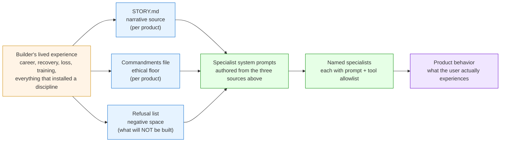
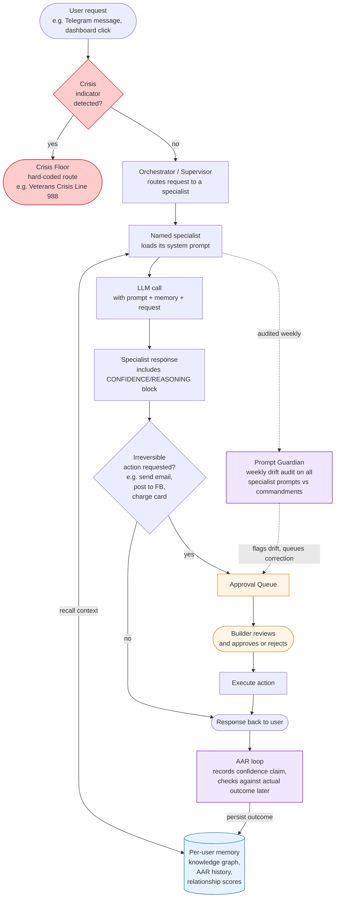

# The Builders' Method — Wiring Diagram and Walkthrough

**Purpose.** A single visual that explains how the framework actually works, end to end. Two diagrams. One numbered walkthrough that traces a real user request through the whole stack. Built so a non-technical reader (SBIR reviewer, VC, EMBA peer, future builder) can see it once and understand what is doing what.

**The big claim it has to prove.** *Biography compiles into product behavior through a stack of reproducible mechanisms.* If you can read these diagrams and see how that works, the framework is doing its job. If you cannot, the framework is failing — diagrams included.

---

## Diagram 1 — How biography becomes product behavior

This is the principle-pipeline diagram. It shows what compiles into what. It is the visual answer to "the code is the story."

**Read it left-to-right.** The orange box on the left is biographical input — your career, your recovery, your training, your losses, the things that installed a discipline whether you wrote them down or not. The blue boxes are the three documents that turn biography into engineering input: STORY.md, the commandments file, and the refusal list. The green boxes are where the documents become live agents — system prompts that get loaded into named specialists. The purple box is what the user sees.

**The portability claim is visible here.** The orange box (biography) is whoever is building. The blue, green, and purple boxes are the same regardless of who is building. Anyone applying the method writes their own STORY.md, their own commandments, their own refusal list. Hans's products are agentic versions of Hans's story; another builder's products would be agentic versions of theirs. The architecture is shared. The biography is not.

---

## Diagram 2 — How a single user request flows through the system at runtime

This is the runtime wiring diagram. It shows what happens when a real user actually uses the product. The goal is to make the safeguards (Crisis Floor, Approval Queue, Memory, Guardian, AAR) visible as real components, not just as principles in a doctrine.

---

## Walkthrough — trace one real request through the runtime diagram

The following is a real request through TOP, the wellness AI flagship. Read each step alongside Diagram 2.

**Setup.** A veteran in the TOP pilot sends a Telegram message: *"I have not slept in three nights. Started thinking about the night Cody died again. Should I be worried?"*

### Step 1. Crisis check (red diamond at top of Diagram 2)

The message hits the system. Before anything else — before routing, before specialist selection, before any LLM call — the request is screened for crisis indicators. This is the Crisis Floor in action. It is hard-coded above every feature. It cannot be A/B-tested. It cannot be turned off. There is no permission setting that disables it.

The screen looks for explicit and implicit indicators of suicidal ideation, acute psychiatric crisis, or self-harm risk. If any indicator fires, the crisis route activates immediately: the Veterans Crisis Line (988, press 1) is surfaced in the response, with text encouraging the user to call now. The wellness specialist may also respond — but the crisis resource is named first and it is unkillable.

In our example, the message is concerning (no sleep + intrusive memory of a soldier's death) but not an explicit crisis indicator. The crisis check does not fire. The request continues to routing.

### Step 2. Orchestrator routing (Diagram 2, second box)

The Orchestrator reads the request and selects which named specialist should handle it. In TOP, specialists include a wellness specialist, a journal specialist, a recipe specialist, a calendar specialist, and others. Each specialist has a defined job and a tool allowlist. None are anonymous. The request about sleep and intrusive memory routes to the wellness specialist.

### Step 3. Specialist loads its system prompt (Diagram 2, third box, with prompt loaded from Diagram 1)

This is the join point between the two diagrams. The wellness specialist loads its system prompt — and that prompt was authored against TOP's commandments file, TOP's STORY.md, and TOP's refusal list. The Stoic commandments are in the prompt. The "no cheerleading" rule is in the prompt. The "honest before comfortable" rule is in the prompt. The discipline of sobriety is in the prompt. Hans's biography is the training data for this specialist because Hans wrote the prompt.

### Step 4. Specialist queries per-user memory (Diagram 2, blue cylinder on the right)

Before composing a response, the wellness specialist queries the per-user memory layer for context: who is this veteran, what have they discussed before, what is the pattern of life. The knowledge graph returns: previous mentions of Cody (KIA Iraq 2009), the user's PTSD diagnosis, prior intrusive-memory episodes, sleep history. The AAR history shows that in past similar episodes, the user's claimed confidence in "I am okay" has been low-calibrated — the user said they were okay and were not.

The memory layer is the moat. Per-user, isolated, persistent. Switching to a competitor's tool would lose all of this context. This is what "the moat is the memory" means in code.

### Step 5. LLM call with prompt + memory + request (Diagram 2, "LLM call" box)

The wellness specialist composes the LLM call with three inputs: the system prompt (compiled from Hans's biography), the recalled memory (this user's specific history), and the user's current message. The LLM produces a response.

### Step 6. CONFIDENCE/REASONING block (Diagram 2, "OUT" box)

The response is not just text. It includes a structured CONFIDENCE/REASONING block — the specialist's own assessment of how confident it is in its response and why. This block is parsed by the orchestrator and persisted to the knowledge graph. It is what the AAR loop later checks against actual outcomes.

In our example, the specialist might respond: *"Three nights without sleep is medically significant. Combined with the intrusive memory of Cody's death surfacing, this is the pattern that has preceded harder episodes for you before. I am 82% confident this needs medical attention within 24 hours, not self-management. The Veterans Crisis Line is 988, press 1. Two questions: have you eaten today, and is anyone with you tonight?"*

That response embodies the Stoic commandments (honest before comfortable, no cheerleading, no false reassurance), pulls on the per-user memory (knows about Cody, knows the pattern), and is calibrated (82% confidence, not "definitely" or "probably fine").

### Step 7. Irreversible action check (Diagram 2, orange diamond)

Before the response is sent, the system checks: does this involve any irreversible action? Sending an email, posting publicly, charging a card, contacting an external party — all gated. In our example, the response is just text back to the user. No irreversible action. The response goes to step 9.

If the specialist had wanted to, say, send a notification to the user's emergency contact, that would have routed through the Approval Queue (orange box). Hans (the builder) would see the queued action in the dashboard, review it, and either approve or reject. The action does not execute without explicit approval. This is "chain of command over autonomous AI" in code.

### Step 8. Approval Queue (when the previous step routes here)

The queue holds pending irreversible actions. The builder is the commander. Until approval, nothing leaves the system. Two-gate compounding: an environmental kill switch (e.g. CAMPAIGN_DRY_RUN) and a structural queue. Either alone is insufficient. Together they make accidental outbound action computationally hard.

### Step 9. Response back to user (Diagram 2, "RESP" pill)

The wellness specialist's response is sent to the user. The conversation continues.

### Step 10. AAR loop (Diagram 2, purple box, lower left)

After the conversation closes, the AAR loop runs. It records the specialist's claimed confidence (82%) and waits for an outcome. Days later, when the user reports "I went to the VA, doc adjusted my meds, sleeping again now," the AAR loop confirms the prediction was right. Or when a different episode plays out and the prediction was wrong, the AAR loop records the miss. Over time, this calibration data accumulates per-specialist. When a specialist consistently overclaims confidence, the Prompt Guardian sees the calibration drift and flags it.

This is "truth as architecture" in code. The product cannot lie to the builder without leaving evidence in the audit trail.

### Step 11. Prompt Guardian (Diagram 2, purple box, lower right)

Once a week, the Prompt Guardian runs a drift audit on every specialist's system prompt. It scores each prompt against the commandments file. It checks for cheerleading. It checks for engagement-maximizing language. It checks for false reassurance. If a prompt has drifted (because the builder edited it, because a model upgrade changed how the prompt reads, because a new specialist was added without proper review), the Guardian queues a correction in the Approval Queue. The builder reviews the proposed correction and approves or rejects.

The Guardian is the immune system. Drift is detected, queued, corrected. Without the Guardian, the framework would be aspirational — principles in a doctrine that nobody enforces. With the Guardian, the principles are measurable.

---

## What changes per builder vs what stays constant

| Layer | Per builder | Constant across builders |
|---|---|---|
| Biography | Yours | — |
| STORY.md content | Yours | The practice of writing it |
| Commandments | Yours (Stoic, palliative-care, etc.) | Having a commandments file + Guardian audit |
| Refusal list | Yours | The practice of explicit negative space |
| Specialist names | Yours | Naming all specialists, no anonymous prompts |
| Crisis trigger | Yours (suicide, oncologic emergency, etc.) | Crisis Floor pattern (hard-coded, ungated) |
| Per-user memory contents | Theirs | Per-user-isolated knowledge graph + AAR |
| Irreversible action list | Yours | Approval Queue gating pattern |
| Drift indicators | Yours | Prompt Guardian audit cadence |

The left column is biographical and product-specific. The right column is the framework. The framework ports; the biography is the moat.

---

## How to use these diagrams

**For a SBIR reviewer.** Lead with Diagram 1. The reviewer wants to know whether the founder built a one-off or a system. Diagram 1 shows a system: biography is engineering input, three documents compile into prompts, prompts run as named specialists, behavior is the output. Then walk through Diagram 2 to show measurement is real (Guardian, AAR, audit trail).

**For a VC.** Lead with Diagram 2. The VC wants to know whether the moat is real. Diagram 2 shows the per-user memory layer, the AAR loop, the chain-of-command gating, and the Guardian. The moat is per-user memory; the defensibility is the audit trail; the safety story is the Crisis Floor and the Approval Queue.

**For an EMBA peer or future builder applying the method.** Use both diagrams together with this walkthrough. The peer's job is to imagine running their own request through Diagram 2 with their own version of the inputs in Diagram 1. If they cannot picture it, the framework is too Hans-coupled and v1.2 has work to do.

**For yourself, to remember why the framework exists.** Diagram 1 is the answer to "the code is the story." Diagram 2 is the answer to "truth as architecture." They are the same answer, drawn at two scales.
